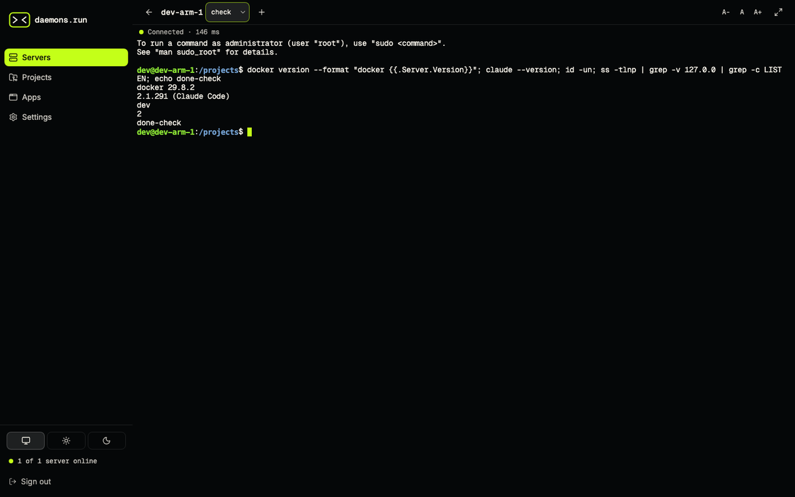

# daemons.run


**Your coding agents on your own server, from any browser.** Provision a normal Ubuntu server, open a terminal in the browser (also on your phone) with Claude Code, Codex or OpenCode ready, and turn `localhost:3000` into a link.



## Install

[](https://deploy.workers.cloudflare.com/?url=https://github.com/tecsteps/daemons-run/tree/main/control-plane)

Or ask your local coding agent:

```
Install daemons.run into my Cloudflare account: follow https://daemons.run/install.md
```

Then open your control plane, register a passkey, paste a Hetzner API token and click **Create server**. Any other Ubuntu 24.04 machine joins with one `curl … | sh` line.

## How it works

```
browser ──HTTPS──▶ your control plane (Cloudflare Worker, D1, Durable Objects)
                         ▲  one outbound WebSocket per server
                         │
your server (Ubuntu) ── daemons-agent: tmux terminals, files, app proxy
```

The server never opens a port for daemons.run: the agent dials out. Apps you expose get their own address, `https://daemons-apps.<you>.workers.dev/<name>/`.

## What it costs

Free and open source. You pay your server provider directly (Hetzner from about €5.50/month, no markup). Normal use fits Cloudflare's free plan.

## Security model

- Passkeys only: no passwords, no email, no third-party login.
- The agent connects outbound; no management port is open on your server.
- Exposed apps run on a separate origin, so app code can never act as you on the control plane. Apps are private (passkey) unless you make a link public.
- Provider credentials are encrypted; the key lives apart from the database.
- Everything runs in your own Cloudflare and Hetzner accounts. There is no daemons.run service in between.

Report vulnerabilities privately: see [SECURITY.md](SECURITY.md).

## Development

```sh
npm install
npm run dev     # control plane on http://localhost:8787 (local D1)
npm test
```

| Folder | What |
|---|---|
| `control-plane/` | Worker (Hono), Durable Objects, D1 migrations, React UI |
| `apps-gateway/` | The `daemons-apps` Worker: the separate origin for apps |
| `agent/` | `daemons-agent` and the `daemons` CLI (Go); wire protocol in [`agent/PROTOCOL.md`](agent/PROTOCOL.md) |
| `installer/` | `install.sh` and the cloud-init template |
| `website/` | The daemons.run homepage |
| `specs/` | The plan: start with [`specs/00-overview.md`](specs/00-overview.md) |

See [CONTRIBUTING.md](CONTRIBUTING.md).

## License

[MIT](LICENSE)
